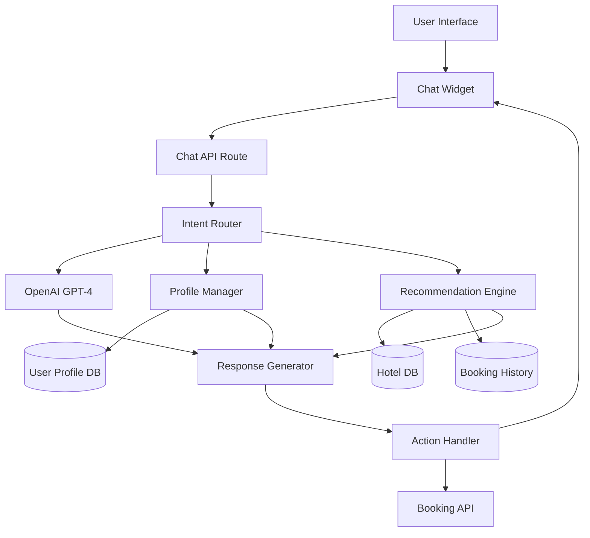

# Advanced AI Assistant - Design Document

## Overview

The Advanced AI Assistant transforms the current basic chatbot into an intelligent travel companion that provides personalized recommendations, price predictions, and comprehensive travel planning. This design focuses on Phase 1 (Foundation) features while establishing an extensible architecture for future enhancements.

### Current State
- Basic intent recognition (search, book, check price)
- Simple entity extraction (location, dates, guest count)
- Rule-based response generation
- Direct booking capability for logged-in users
- Conversation history storage

### Target State (Phase 1)
- Enhanced NLP with OpenAI GPT-4 integration
- User profile tracking and preference learning
- Basic recommendation engine (collaborative + content-based)
- Improved conversation context management
- Foundation for price prediction and sentiment analysis

### Design Principles
1. **Incremental Enhancement**: Build on existing working system
2. **API-First**: Use proven AI services (OpenAI) rather than building from scratch
3. **Data-Driven**: Collect user interaction data for continuous improvement
4. **Privacy-Conscious**: Clear opt-in/opt-out for personalization
5. **Fallback-Ready**: Graceful degradation when AI services fail

## Architecture

### High-Level Architecture



### Component Layers

**Presentation Layer**
- ChatWidget (React component)
- Voice input interface (Phase 3)
- Quick action buttons

**API Layer**
- `/api/ai/chat` - Main conversation endpoint
- `/api/ai/book-room` - AI-triggered booking
- `/api/ai/profile` - User preference management
- `/api/ai/recommendations` - Personalized suggestions

**Intelligence Layer**
- Intent Classification Service
- Entity Extraction Service
- Context Management Service
- Recommendation Engine
- Response Generation Service

**Data Layer**
- User profiles and preferences
- Conversation history
- Hotel and booking data
- Price history (Phase 2)
- Review corpus (Phase 2)

## Components and Interfaces

### 1. Intent Classification Service

**Purpose**: Determine user intent from natural language input using OpenAI GPT-4

**Interface**:
```typescript
interface IntentClassificationService {
  classifyIntent(message: string, context: ConversationContext): Promise<Intent>;
}

interface Intent {
  primary: IntentType;
  secondary?: IntentType[];
  confidence: number;
  entities: ExtractedEntity[];
}

enum IntentType {
  SEARCH_HOTELS = 'search_hotels',
  BOOK_ROOM = 'book_room',
  CHECK_PRICE = 'check_price',
  CHECK_AVAILABILITY = 'check_availability',
  GET_RECOMMENDATIONS = 'get_recommendations',
  PLAN_TRIP = 'plan_trip',
  ASK_INFO = 'ask_info',
  GREETING = 'greeting',
  CANCEL_BOOKING = 'cancel_booking'
}

interface ExtractedEntity {
  type: 'location' | 'date' | 'price' | 'guest_count' | 'hotel_name' | 'amenity';
  value: string;
  normalized: any;
  confidence: number;
}
```

**Implementation Strategy**:
- Use OpenAI GPT-4 with structured output (function calling)
- Provide few-shot examples for Vietnamese language understanding
- Fallback to rule-based classification if API fails
- Cache common patterns to reduce API calls

### 2. User Profile Manager

**Purpose**: Track user preferences, booking history, and behavioral patterns

**Interface**:
```typescript
interface UserProfileManager {
  getProfile(userId: string): Promise<UserProfile>;
  updatePreferences(userId: string, preferences: Partial<UserPreferences>): Promise<void>;
  recordInteraction(userId: string, interaction: Interaction): Promise<void>;
  inferPreferences(userId: string): Promise<InferredPreferences>;
}

interface UserProfile {
  userId: string;
  explicitPreferences: UserPreferences;
  implicitPreferences: InferredPreferences;
  bookingHistory: BookingSummary[];
  searchHistory: SearchPattern[];
  lastInteraction: Date;
}

interface UserPreferences {
  favoriteLocations: string[];
  budgetRange: { min: number; max: number };
  preferredRoomTypes: string[];
  preferredAmenities: string[];
  travelCompanions: number;
  travelFrequency: 'occasional' | 'frequent' | 'business';
}

interface InferredPreferences {
  likelyBudget: number;
  preferredSeason: string[];
  hotelTypePreference: 'resort' | 'business' | 'budget' | 'luxury';
  bookingLeadTime: number; // days before travel
  averageStayDuration: number; // nights
}
```

**Data Storage**:
- New Prisma model: `UserProfile`
- New Prisma model: `UserInteraction`
- Extend existing `User` model with preference fields

### 3. Recommendation Engine

**Purpose**: Generate personalized hotel recommendations using collaborative and content-based filtering

**Interface**:
```typescript
interface RecommendationEngine {
  getRecommendations(userId: string, context: SearchContext): Promise<Recommendation[]>;
  explainRecommendation(hotelId: string, userId: string): Promise<string>;
}

interface Recommendation {
  hotel: Hotel;
  score: number;
  reasons: string[];
  matchedPreferences: string[];
}

interface SearchContext {
  location?: string;
  checkIn?: Date;
  checkOut?: Date;
  guestCount?: number;
  budget?: number;
  amenities?: string[];
}
```

**Algorithm Design**:

**Collaborative Filtering**:
- Find users with similar booking patterns
- Recommend hotels they liked but current user hasn't seen
- Weight by recency and rating

**Content-Based Filtering**:
- Match hotel features to user preferences
- Score based on: location, price range, amenities, rating
- Boost hotels in user's favorite cities

**Hybrid Scoring**:
```
final_score = 0.4 * collaborative_score + 0.6 * content_score
```

**Implementation**:
- Start with simple SQL queries for Phase 1
- Use vector embeddings for similarity in Phase 2
- Cache recommendations for 1 hour

### 4. Context Management Service

**Purpose**: Maintain conversation state and history for coherent multi-turn dialogues

**Interface**:
```typescript
interface ContextManager {
  getContext(sessionId: string): Promise<ConversationContext>;
  updateContext(sessionId: string, update: ContextUpdate): Promise<void>;
  clearContext(sessionId: string): Promise<void>;
}

interface ConversationContext {
  sessionId: string;
  userId?: string;
  messages: Message[];
  currentIntent?: Intent;
  pendingAction?: PendingAction;
  extractedInfo: {
    location?: string;
    dates?: { checkIn: Date; checkOut: Date };
    guestCount?: number;
    budget?: number;
    selectedHotel?: string;
  };
  conversationStage: ConversationStage;
}

enum ConversationStage {
  GREETING = 'greeting',
  GATHERING_INFO = 'gathering_info',
  SHOWING_OPTIONS = 'showing_options',
  CONFIRMING_BOOKING = 'confirming_booking',
  COMPLETED = 'completed'
}

interface PendingAction {
  type: 'book_room' | 'show_hotels' | 'check_availability';
  data: any;
  missingFields: string[];
}
```

**Storage Strategy**:
- Use Redis for session state (TTL: 30 minutes)
- Persist important conversations to PostgreSQL
- Implement conversation summarization for long sessions

### 5. Response Generation Service

**Purpose**: Generate natural, contextual responses using OpenAI GPT-4

**Interface**:
```typescript
interface ResponseGenerator {
  generateResponse(
    intent: Intent,
    context: ConversationContext,
    data: any
  ): Promise<AIResponse>;
}

interface AIResponse {
  text: string;
  actions?: Action[];
  suggestions?: string[];
  requiresUserInput?: string[];
}

interface Action {
  type: 'book_room' | 'show_hotels' | 'check_availability' | 'update_profile';
  data: any;
  autoExecute: boolean;
}
```

**Prompt Engineering Strategy**:
- System prompt defines AI personality and capabilities
- Include user profile summary in context
- Provide hotel data in structured format
- Use temperature=0.7 for natural but consistent responses
- Implement response validation and sanitization

### 6. OpenAI Integration Service

**Purpose**: Centralized service for all OpenAI API interactions

**Interface**:
```typescript
interface OpenAIService {
  chat(messages: ChatMessage[], options?: ChatOptions): Promise<ChatCompletion>;
  extractStructuredData(text: string, schema: JSONSchema): Promise<any>;
  embedText(text: string): Promise<number[]>; // Phase 2
}

interface ChatOptions {
  model?: 'gpt-4' | 'gpt-3.5-turbo';
  temperature?: number;
  maxTokens?: number;
  functions?: FunctionDefinition[];
}
```

**Configuration**:
- API Key: Environment variable `OPENAI_API_KEY`
- Default model: GPT-4 for complex queries, GPT-3.5-turbo for simple ones
- Rate limiting: 60 requests/minute
- Timeout: 30 seconds
- Retry strategy: Exponential backoff (3 attempts)

## Data Models

### New Prisma Models

```prisma
// User profile for AI personalization
model UserProfile {
  id     String @id @default(cuid())
  userId String @unique
  
  // Explicit preferences (user-provided)
  favoriteLocations    String[]
  budgetMin            Float?
  budgetMax            Float?
  preferredRoomTypes   String[]
  preferredAmenities   String[]
  travelCompanions     Int      @default(2)
  travelFrequency      String?  // occasional, frequent, business
  
  // Inferred preferences (AI-learned)
  inferredBudget       Float?
  preferredSeasons     String[]
  hotelTypePreference  String?  // resort, business, budget, luxury
  avgBookingLeadTime   Int?     // days
  avgStayDuration      Int?     // nights
  
  // Privacy settings
  personalizationEnabled Boolean @default(true)
  dataCollectionConsent  Boolean @default(false)
  
  user User @relation(fields: [userId], references: [id], onDelete: Cascade)
  
  createdAt DateTime @default(now())
  updatedAt DateTime @updatedAt
  
  @@index([userId])
}

// Track user interactions for learning
model UserInteraction {
  id     String @id @default(cuid())
  userId String
  
  interactionType String // search, view, book, click, message
  entityType      String? // hotel, room, location
  entityId        String?
  
  metadata Json? // flexible storage for interaction details
  
  user User @relation(fields: [userId], references: [id], onDelete: Cascade)
  
  createdAt DateTime @default(now())
  
  @@index([userId, createdAt])
  @@index([interactionType])
}

// Price history for prediction (Phase 2)
model PriceHistory {
  id     String @id @default(cuid())
  roomId String
  
  date  DateTime @db.Date
  price Float
  
  // Context for price changes
  dayOfWeek    Int
  isWeekend    Boolean
  isHoliday    Boolean
  seasonalFlag String? // peak, off-peak, shoulder
  
  room Room @relation(fields: [roomId], references: [id], onDelete: Cascade)
  
  createdAt DateTime @default(now())
  
  @@unique([roomId, date])
  @@index([roomId, date])
}

// Review sentiment analysis (Phase 2)
model ReviewAnalysis {
  id       String @id @default(cuid())
  reviewId String @unique
  
  sentimentScore Float // -1 to 1
  sentimentLabel String // positive, neutral, negative
  
  // Extracted aspects
  aspects Json // { "cleanliness": 0.8, "location": 0.9, "service": 0.7 }
  
  // Key phrases
  positivePoints String[]
  negativePoints String[]
  
  createdAt DateTime @default(now())
  
  @@index([sentimentLabel])
}

// AI conversation sessions
model ConversationSession {
  id        String @id @default(cuid())
  userId    String?
  sessionId String @unique
  
  // Session state
  stage         String // greeting, gathering_info, showing_options, etc.
  extractedInfo Json   // current extracted entities
  
  // Metadata
  startedAt  DateTime @default(now())
  lastActive DateTime @default(now())
  endedAt    DateTime?
  
  user User? @relation(fields: [userId], references: [id], onDelete: Cascade)
  
  @@index([userId])
  @@index([sessionId])
  @@index([lastActive])
}
```

### Extended Models

```prisma
// Extend User model
model User {
  // ... existing fields ...
  
  profile             UserProfile?
  interactions        UserInteraction[]
  conversationSessions ConversationSession[]
}

// Extend Room model
model Room {
  // ... existing fields ...
  
  priceHistory PriceHistory[]
}
```

## Error Handling

### Error Categories

**1. External Service Errors**
- OpenAI API failures (timeout, rate limit, invalid response)
- Database connection issues
- Network errors

**Strategy**:
- Implement circuit breaker pattern for OpenAI
- Fallback to rule-based responses when AI unavailable
- Cache recent successful responses
- Show user-friendly error messages

**2. Data Validation Errors**
- Invalid dates (past dates, checkout before checkin)
- Invalid guest counts
- Missing required fields

**Strategy**:
- Validate early in the request pipeline
- Provide specific error messages
- Suggest corrections to user

**3. Business Logic Errors**
- No rooms available
- Hotel not found
- Booking conflicts

**Strategy**:
- Return structured error responses
- Suggest alternatives
- Allow user to modify search criteria

### Error Response Format

```typescript
interface ErrorResponse {
  error: string;
  errorCode: string;
  details?: any;
  suggestions?: string[];
  fallbackResponse?: string;
}
```

### Fallback Mechanisms

**Level 1: OpenAI Failure**
- Use rule-based intent classification
- Generate template-based responses
- Maintain core functionality

**Level 2: Database Failure**
- Return cached hotel data
- Disable booking temporarily
- Show maintenance message

**Level 3: Complete System Failure**
- Display static help information
- Provide contact information
- Log error for investigation

## Testing Strategy

### Unit Testing
- Test individual services in isolation
- Mock external dependencies (OpenAI, database)
- Focus on business logic and data transformations
- Target: 80% code coverage

**Key Test Areas**:
- Intent classification with various inputs
- Entity extraction accuracy
- Recommendation scoring algorithm
- Context management state transitions
- Error handling and fallback logic

### Integration Testing
- Test API endpoints end-to-end
- Use test database with seed data
- Mock OpenAI responses for consistency
- Test conversation flows across multiple turns

**Test Scenarios**:
- Complete booking flow via chat
- Multi-turn conversation with context
- Error recovery and fallback
- Profile learning from interactions

### Property-Based Testing
- Generate random user inputs
- Verify system invariants hold
- Test edge cases automatically
- Minimum 100 iterations per property

**Properties to Test**:
- (Will be defined after prework analysis)

### Manual Testing
- Test with real OpenAI API in staging
- Verify Vietnamese language understanding
- Test voice input (Phase 3)
- User acceptance testing with beta users

### Performance Testing
- Load test: 1000 concurrent conversations
- Response time: < 2s for simple queries, < 5s for complex
- OpenAI API rate limit handling
- Database query optimization

## Implementation Notes

### Phase 1 Priorities (Foundation)

**Week 1-2: Core Infrastructure**
1. Set up OpenAI integration service
2. Implement new data models (UserProfile, UserInteraction)
3. Create profile manager service
4. Enhance context management

**Week 3-4: Intelligence Layer**
5. Implement intent classification with OpenAI
6. Build basic recommendation engine
7. Enhance response generation
8. Add conversation flow management

**Week 5-6: Integration & Testing**
9. Integrate all services into chat API
10. Implement error handling and fallbacks
11. Write comprehensive tests
12. Performance optimization

### Technology Stack

**Backend**:
- Next.js 14 API Routes
- Prisma ORM
- PostgreSQL database
- OpenAI API (GPT-4)
- Redis for session management (optional for Phase 1)

**Frontend**:
- React 18
- TypeScript
- Existing ChatWidget component (enhanced)
- Tailwind CSS

**Testing**:
- Jest for unit tests
- Playwright for integration tests
- Fast-check for property-based tests

### Configuration

**Environment Variables**:
```env
OPENAI_API_KEY=sk-...
OPENAI_MODEL=gpt-4
OPENAI_MAX_TOKENS=1000
OPENAI_TEMPERATURE=0.7

AI_FEATURE_ENABLED=true
AI_PERSONALIZATION_ENABLED=true
AI_FALLBACK_MODE=rule-based

REDIS_URL=redis://localhost:6379 # Optional for Phase 1
```

### Monitoring and Analytics

**Metrics to Track**:
- Conversation completion rate
- Average conversation length
- Intent classification accuracy
- Booking conversion rate via AI
- OpenAI API usage and costs
- Response time percentiles
- Error rates by category

**Logging**:
- Log all AI interactions (with user consent)
- Track OpenAI API calls and costs
- Monitor error patterns
- Record user feedback

### Privacy and Compliance

**Data Collection**:
- Explicit opt-in for personalization
- Clear disclosure of data usage
- Allow users to view their profile data
- Provide data deletion option

**Data Retention**:
- Conversation history: 90 days
- User profiles: Until account deletion
- Interaction logs: 180 days
- Anonymous analytics: Indefinite

**Security**:
- Encrypt sensitive data at rest
- Sanitize user inputs
- Rate limit API endpoints
- Implement CSRF protection


## Correctness Properties

A property is a characteristic or behavior that should hold true across all valid executions of a system—essentially, a formal statement about what the system should do. Properties serve as the bridge between human-readable specifications and machine-verifiable correctness guarantees.

### Property 1: User Profile Round-Trip Consistency
*For any* user profile with preferences (favorite locations, budget range, room types, travel companions, travel times), storing the profile and then retrieving it should return an equivalent profile with all preferences intact.

**Validates: Requirements 1.1, 1.3**

### Property 2: Recommendation Preference Alignment
*For any* user with booking history showing a clear preference for a specific hotel type (e.g., 80%+ bookings are resorts), the recommendation engine should prioritize hotels of that type in the top 3 results.

**Validates: Requirements 1.2**

### Property 3: Booking Form Auto-Fill Completeness
*For any* user with stored preferences (guest count, typical stay duration, preferred amenities), when initiating a booking, the form should be pre-filled with all available preference values.

**Validates: Requirements 1.4**

### Property 4: Price Comparison Mathematical Correctness
*For any* room with at least 30 days of price history, the current price comparison should correctly calculate the average of the last 30 days and the percentage difference from current price.

**Validates: Requirements 2.3**

### Property 5: Price Drop Alert Generation
*For any* user watching a location, if the price for any hotel in that location drops by more than 10%, an alert should be generated for that user.

**Validates: Requirements 2.4**

### Property 6: Trip Plan Entity Completeness
*For any* generated trip plan for a destination, the plan should include at least one hotel, at least one attraction, and at least one restaurant recommendation.

**Validates: Requirements 3.2**

### Property 7: Travel Time Calculation Validity
*For any* two locations in a trip plan, the calculated travel time should be positive, non-zero, and less than 24 hours (within same country).

**Validates: Requirements 3.3**

### Property 8: Complex Query Entity Extraction
*For any* search query containing multiple criteria (location, amenities, price range, guest requirements), all explicitly mentioned entities should be extracted and included in the search filters.

**Validates: Requirements 4.1**

### Property 9: Search Filter Compliance
*For any* search with specified filters (amenities, location, price range, rating), all returned results should satisfy every filter criterion.

**Validates: Requirements 4.2**

### Property 10: Recommendation Score Ordering
*For any* set of hotel recommendations, the results should be ordered in descending order by relevance score, with no two consecutive hotels having the same score unless they are truly tied.

**Validates: Requirements 4.3**

### Property 11: Recommendation Explanation Presence
*For any* hotel recommendation, an explanation should be provided that references at least one reason why the hotel was recommended.

**Validates: Requirements 4.4**

### Property 12: Proactive Notification Appropriateness
*For any* user with a clear seasonal travel pattern (e.g., travels to location X in month Y for 2+ consecutive years), a proactive reminder should be generated 30-60 days before that month.

**Validates: Requirements 5.1**

### Property 13: Low Inventory Alert Triggering
*For any* hotel that a user has viewed, if the available room count drops below 3, an urgency alert should be generated for that user.

**Validates: Requirements 5.2**

### Property 14: Cross-Sell Opportunity Detection
*For any* hotel booking, if a flight or combo deal exists for the same destination and dates, it should be suggested to the user.

**Validates: Requirements 5.3**

### Property 15: Follow-Up Message Timing
*For any* confirmed booking, a follow-up message should be sent between 3-7 days before the check-in date.

**Validates: Requirements 5.4**

### Property 16: Review Summary Key Points
*For any* hotel with 10+ reviews, the summary should extract and present 3-5 key points that appear in multiple reviews.

**Validates: Requirements 7.1**

### Property 17: Sentiment Distribution Validity
*For any* set of reviews analyzed for sentiment, the sum of positive, neutral, and negative percentages should equal 100%, and each percentage should be between 0 and 100.

**Validates: Requirements 7.2**

### Property 18: Aspect Extraction Completeness
*For any* hotel with reviews, the analysis should identify at least one strength and at least one weakness (or explicitly state "no weaknesses found" if all reviews are positive).

**Validates: Requirements 7.3**

### Property 19: Personalized Recommendation Matching
*For any* recommendation shown to a user with explicit preferences, the explanation should reference at least one of the user's stated preferences.

**Validates: Requirements 7.4**

### Property 20: Optimal Voucher Selection
*For any* booking where multiple vouchers are applicable, the system should automatically select and apply the voucher that provides the maximum discount.

**Validates: Requirements 8.1**

### Property 21: Multi-Room Pricing Optimization
*For any* booking request for N rooms (N > 1), if booking N rooms together is cheaper than N separate bookings, the system should suggest the cheaper option.

**Validates: Requirements 8.2**

### Property 22: Points Conversion Accuracy
*For any* user with loyalty points, the conversion rate to discount should be mathematically correct and consistent (e.g., if 100 points = 40k VND, then 500 points = 200k VND).

**Validates: Requirements 8.3**

### Property 23: Flash Deal Visibility
*For any* active flash deal (time-limited offer), it should be displayed to users searching for relevant hotels during the deal period.

**Validates: Requirements 8.4**

### Property 24: Booking Information Completeness
*For any* conversational booking flow, before finalizing the booking, the system should have collected and confirmed all required fields: location, check-in date, check-out date, guest count, and selected hotel.

**Validates: Requirements 9.1, 9.2**

### Property 25: Context Modification Correctness
*For any* booking in progress, when the user requests a modification (e.g., "change to 3 nights"), the system should update only the relevant field (check-out date) while preserving all other booking details.

**Validates: Requirements 9.3**

### Property 26: Multi-Language Response Consistency
*For any* supported language (Vietnamese, English, Chinese, Korean, Japanese), when the same query is asked in different languages, the semantic content of the response should be equivalent (same hotels, same information).

**Validates: Requirements 10.1**

### Property 27: Language Detection Accuracy
*For any* input text in a supported language, the language detection should correctly identify the language with at least 95% confidence.

**Validates: Requirements 10.2**

### Property 28: Locale-Specific Formatting
*For any* response containing dates or prices, the formatting should match the detected locale (e.g., Vietnamese: dd/mm/yyyy and 1.000.000đ, English: mm/dd/yyyy and $1,000).

**Validates: Requirements 10.4**
